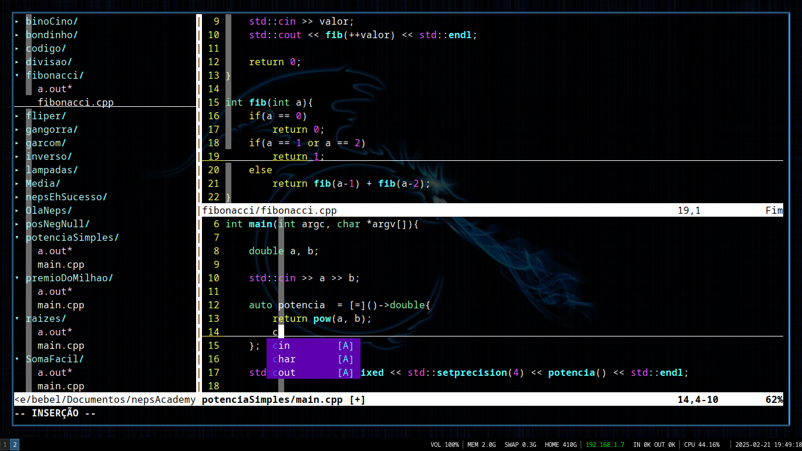
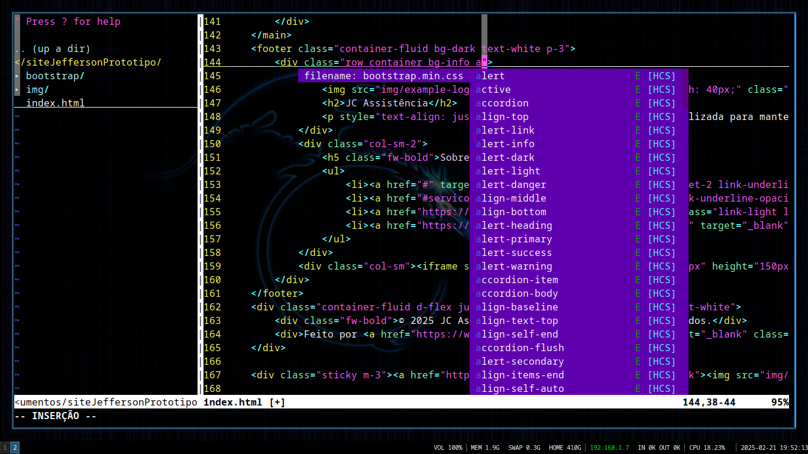

<!DOCTYPE HTML>
<html>
    <body>
        <h1>Configuração Básica do Vim com VimPlug</h1>
        
O Vim é um editor de texto poderoso! Além de leve (ja que ele roda diretamente do 
        terminal), esse editor é muito poderoso e customizável. Mas ninguém merece ficar
        perdendo o seu tempo configurando o Vim. Pensando nisso, irei disponibilizar a minha
        configuração básica do Vim.

        
    
        <h2>Requisitos:</h2>
        <ul>
            <li>Instalar o Vim</li>
            <li>Instalar o <a href="https://github.com/junegunn/vim-plug">VimPlug</a></li>
            <li>Instalar o <a href="https://github.com/neoclide/coc.nvim">coc.nvim</a></li>
        </ul>
        
    
        <h2>Configuração [Linux]:</h2>
        
Crie o arquivo .vimrc na sua pasta home: 

        <pre><code>touch /home/$USER/.vimrc</code></pre>
        
Após isso, abra o arquivo criado na sua pasta home com um editor de texto e
        cole o código do meu vimrc que disponibilizei acima.

        
Por último, salve o seu .vimrc, entre no vim e use o comando <pre><code>:PlugInstall</code></pre>

        
Pronto! Tudo estará configurado.

        

        <h2>Screenshots</h2>
        
        
        

        
    </body>
</html>
